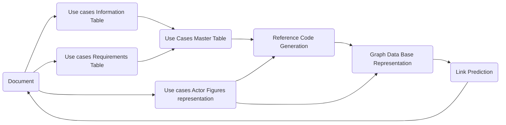

# FGAN-build-a-thon

# Deriving New Use cases According to link Prediction Algorithm:

## 0. Problem Statement:
This Work is to be submitted to the ITU as a part of ITU ML5G Challenge and under the problem 10 which is BYOC(Build your own closed loop), and the aim of this project is build a new closed loop to discover the possibility of new use cases of Autonomous network, based on the previuos use cases came from the provided document.[FGAN-O-013-R1]
****

## 1. Report:
You can find the full report [here](https://github.com/ITU-AI-ML-in-5G-Challenge/ITU-ML5G-PS-010-Build-a-thon-InnovNet/blob/main/report/Final%20Report.pdf).

## 2. Libraries, software and tools used:
- Python 3
- Jupyter notebook
- Pandas
- Numpy
- XML
- Docx
- neo4j (Graph Database representation)
- PantUML (Representing Image)
- Draw,io (Representing Images)

## 3. Work Flow and introduction:

All starts with the document, we parse the use case document, and the parsing here is divided into two main parts:
1- Parsing Text of the use cases.
2- Parsing the Figures that represents the use cases.

After parsing we have all the required information to start working on generating the reference code, or if the actor representation is full with the details, and we parsed this figures very well, then we can make move on to the next step.

After we have a proper representation for this details, then we can turn this representation into graph using any graph database structure, we used here neo4J.

After the graph representation, then we an apply any kind of algorithm there, we used the Random Forest Model to predict new links which may help us to discover new use cases for the AN.

After that-as a future step- if we are sure about new links to be exist, then we can write these ones into a new use cases document.

## 4. Parsing Part:
### 4.1 Parsing Text:
#### 4.1.1 Parsing Use Cases table:
In this stage we need to parse the tables of the use cases, we have a lot of tables, so we need to select the tables of use cases only, tables can be like this:
****
And after parsing we got the following table with all data found on these tables about all use cases in one place:
****
#### 4.1.2 Parsing Requirements:
For each use case we have some requirement with its corresponding details importance, so we need to parse both requirements and importance.

After Finishing parsing both we can end up with a table like this:
****

As we can see, we can find all details about each use case in one row, so we have all these details in one place about all use cases.

### 4.2 Parsing Images:
Actor representations in the file is represented in images like this:
****
Or this:
****

Images is not parsable, so first we need to convert it to machine readable format, and to do this task and after some trials with:
- PlantUML.
- Draw,io.
We ended up using draw.io to represent these images, you can find the files here in this [drive](https://drive.google.com/drive/folders/1d2f3R3NwCfCI58CPkKP7BZkwsoJoZ4j8?usp=sharing).

After that we used XML library to parses these figures and ended up with a table that represents the relations and also a dictionary for all functions in the nodes.
****
****

Now we have parsed all required details from the document, and the following step is to convert this data into suitable representation.

## 5. Graph database representation:
After some trials we have 3 scenarios:
### 5.1 Scenario 1: Using Only parsed figures:
In this scenario we have used only parsed nodes and relations from figures, this scenario will be good if we are sure that we have a proper representation for all use cases, unfortunately this is not the case, so we tried this scenario first to test the availability of Applying Link prediction on it.
### 5.2 Scenario 2: Pure reference code:
we have found that the [reference code](https://github.com/vrra/FGAN-Build-a-thon-2022/blob/main/Notebooks2022/build_a_thon_graph_v1.ipynb) from [Dr. Vishnu](https://github.com/vrra) is a perfect representation for all use cases, so we depend on this representation without any edit on it and applied the link prediction algorithm on it.

### 5.3 Scenario 3: Enhanced reference code:
Now we made some small edit, which is adding functions of the nodes in the graph as node properties, we implemented this for only the first 20 use cases to test, and we we have found that helps the algorithm to perform better.

## 6 Link Prediction:
We have used Random forest-as we found it the best performer- to predict new links, but before that we made some pre-processing, this includes:
### 6.1 Adding node properties Like:
- Centrality
- Node Embedding
- Community detection
### 6.2 Calculating combined features:
Combined features is something like similarity functions, this calculations done for each property we add, we have used:
- Cosine Similarity.
- L2 Similarity.
- Hadamard Similarity
All details about these functions found in neo4J website

We have reached 86% of AUC as an accuracy metric in the third scenario.

We recommend to read the full report to have all details and information about each stage, all references also mentioned there.
